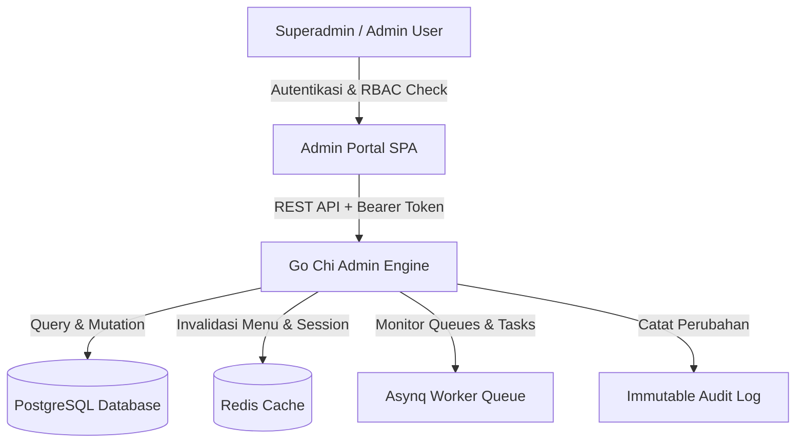

# 🛡️ Executive Master Plan: Admin & System Management Platform (`ADMIN_PLAN.md`)

Dokumen ini merupakan **Cetak Biru Arsitektur & Rencana Pengembangan Sistem Manajemen Admin** (*Superadmin Portal*) untuk platform URL Shortener. Dokumen ini dirancang dengan standar *Enterprise-Grade Best Practices*, mencakup tata kelola pengguna, kontrol akses berbasis peran (*RBAC*), manajemen menu dinamik, pengawasan link global, auditibilitas keamanan, dan pemantauan sistem.

---

## 📐 1. Visi & Arsitektur Utama

Platform admin dirancang untuk memberikan kendali penuh bagi Admin Utama (*Superadmin*) dalam mengelola seluruh ekosistem aplikasi tanpa perlu melakukan *re-deployment* kode.



### Prinsip Utama Perancangan:
1. **Zero Hardcoded Access Control**: Seluruh izin (*permissions*) dan struktur navigasi tersimpan secara dinamik di database dan dapat dikonfigurasi melalui UI.
2. **Auditability First**: Setiap aksi administratif (*Create, Read, Update, Delete, Suspend, Override*) dicatat secara mutlak dalam *Audit Trail Log*.
3. **High Performance & Cache-backed**: Konfigurasi menu dan *permissions* di-cache menggunakan Redis dengan mekanisme pub/sub invalidasi otomatis.
4. **Least Privilege Enforcement**: Pengguna hanya memiliki akses ke fitur yang diizinkan secara eksplisit oleh *Role* mereka.

---

## 🗄️ 2. Skema Database Proposals (PostgreSQL / SQLC)

### 2.1. Skema RBAC & Kontrol Akses

```sql
-- Tabel Peran Pengguna (Roles)
CREATE TABLE roles (
    id UUID PRIMARY KEY DEFAULT gen_random_uuid(),
    name VARCHAR(50) UNIQUE NOT NULL, -- e.g., 'superadmin', 'admin', 'moderator', 'support'
    display_name VARCHAR(100) NOT NULL,
    description TEXT,
    is_system BOOLEAN DEFAULT false, -- True jika role bawaan sistem (tidak bisa dihapus)
    created_at TIMESTAMPTZ NOT NULL DEFAULT NOW(),
    updated_at TIMESTAMPTZ NOT NULL DEFAULT NOW()
);

-- Tabel Hak Akses Modul (Permissions)
CREATE TABLE permissions (
    id UUID PRIMARY KEY DEFAULT gen_random_uuid(),
    code VARCHAR(100) UNIQUE NOT NULL, -- e.g., 'users.read', 'users.write', 'links.ban', 'system.config'
    module VARCHAR(50) NOT NULL,        -- e.g., 'users', 'links', 'roles', 'menus', 'analytics'
    action VARCHAR(50) NOT NULL,        -- e.g., 'create', 'read', 'update', 'delete', 'manage'
    description TEXT,
    created_at TIMESTAMPTZ NOT NULL DEFAULT NOW()
);

-- Pemetaan Peran ke Hak Akses (Role-Permission Mapping)
CREATE TABLE role_permissions (
    role_id UUID NOT NULL REFERENCES roles(id) ON DELETE CASCADE,
    permission_id UUID NOT NULL REFERENCES permissions(id) ON DELETE CASCADE,
    PRIMARY KEY (role_id, permission_id)
);
```

### 2.2. Skema Manajemen Menu & Submenu Dinamik

```sql
-- Tabel Struktur Navigasi Menu & Submenu
CREATE TABLE navigation_menus (
    id UUID PRIMARY KEY DEFAULT gen_random_uuid(),
    parent_id UUID REFERENCES navigation_menus(id) ON DELETE CASCADE, -- NULL untuk Top Parent Menu
    title VARCHAR(100) NOT NULL,
    path VARCHAR(255) NOT NULL,       -- Route URL (misal: '/dashboard/admin/users')
    icon VARCHAR(50),                 -- Nama Lucide Icon (misal: 'UserCogIcon')
    order_index INT NOT NULL DEFAULT 0, -- Urutan tampilan di sidebar
    is_active BOOLEAN DEFAULT true,
    is_external BOOLEAN DEFAULT false,
    badge_text VARCHAR(20),
    permission_code VARCHAR(100) REFERENCES permissions(code) ON DELETE SET NULL, -- Permission yang dipersyaratkan untuk melihat menu ini
    created_at TIMESTAMPTZ NOT NULL DEFAULT NOW(),
    updated_at TIMESTAMPTZ NOT NULL DEFAULT NOW()
);
```

### 2.3. Skema Audit Log Keamanan

```sql
-- Tabel Catatan Jejak Audit Kompleks
CREATE TABLE audit_logs (
    id UUID PRIMARY KEY DEFAULT gen_random_uuid(),
    actor_id UUID REFERENCES users(id) ON DELETE SET NULL,
    actor_email VARCHAR(255) NOT NULL,
    action VARCHAR(100) NOT NULL,        -- e.g., 'USER_SUSPENDED', 'ROLE_PERMISSIONS_UPDATED', 'LINK_BANNED'
    resource VARCHAR(100) NOT NULL,      -- e.g., 'user', 'role', 'short_url', 'system_setting'
    resource_id VARCHAR(255),            -- ID dari objek yang diubah
    payload JSONB,                       -- Snapshot data sebelum & sesudah perubahan (Diff)
    ip_address VARCHAR(45) NOT NULL,
    user_agent TEXT NOT NULL,
    created_at TIMESTAMPTZ NOT NULL DEFAULT NOW()
);
```

---

## 🚀 3. Rincian Modul Fitur Admin Management

### 📊 Modul 1: Executive Admin Dashboard & Metrics
- **System Health Monitor**: Status real-time server Go API, PostgreSQL, Redis, dan NATS worker node.
- **Key Performance Indicators (KPIs)**:
  - Total pengguna aktif vs terblokir (*User Growth Rate*).
  - Total short link yang dibuat & total klik kumulatif (*Traffic Velocity*).
  - *Click-through Rate* (CTR) & rasio deteksi malware/phishing.
- **Asynq Task Queue Gauge**: Jumlah antrean job latar belakang, latency pengolahan analitik, dan status *Dead Letter Queue* (DLQ).
- **Recent Audit Activity Stream**: Feed langsung dari 10 aksi administratif terakhir.

### 👤 Modul 2: User & Account Lifecycle Management
- **Advanced User Search & Filter**: Pencarian berdasarkan nama, email, peran, status (*Active/Suspended/Pending*), dan rentang tanggal pendaftaran.
- **Aksi Manajemen Pengguna**:
  - **Suspend / Unsuspend User**: Membekukan akses pengguna bermasalah secara instant.
  - **Force Revoke Sessions**: Membatalkan seluruh token JWT & sesi aktif pengguna tertentu dari Redis.
  - **Role Re-assignment**: Mengubah peran pengguna (misal *User* ➔ *Admin*).
  - **Password Reset Override**: Mengirimkan link reset password resmi atau menyetel password sementara.
  - **Impersonate User Mode**: Kemampuan Admin untuk masuk (*login-as*) sebagai pengguna tertentu untuk pemecahan masalah (dengan *audit logging* ketat).

### 🔐 Modul 3: Dynamic RBAC & Permission Matrix Management
- **Role Builder**: Membuat, mengubah, dan menghapus peran kustom (misal: `Support Tier 1`, `Link Moderator`, `Finance`).
- **Matrix Permission Editor**: Antarmuka berbasis tabel *checkbox* untuk menetapkan *Permissions* spesifik ke *Role*.
- **Permission Seeder & Scanner**: Deteksi otomatis kode izin baru yang ditambahkan di backend Go.

### 🗂️ Modul 4: Dynamic Navigation & Menu Builder
- **Drag-and-Drop / Order Reordering**: Mengatur urutan *Parent Menu* dan *Submenu* secara langsung dari UI Admin.
- **Role & Permission Guard Mapping**: Menghubungkan setiap item menu dengan `permission_code` tertentu.
- **Menu Visibility Toggles**: Menyembunyikan atau menampilkan modul tertentu secara sementara (*Feature Gating*).

### 🔗 Modul 5: Global URL Oversight & Abuse Control
- **Global Link Inspector**: Memantau seluruh link yang dipendekkan di dalam sistem oleh semua pengguna.
- **Automated / Manual Abuse Banning**:
  - Memblokir *short code* atau *domain tujuan* berbahaya (*Malware, Phishing, Spam*).
  - *Domain Blacklist & Whitelist Management*.
- **Bulk Operations**: Membekukan atau menghapus banyak link bermasalah dalam sekali klik.
- **QR Code Diagnostic**: Memeriksa dan mengunduh format QR Code untuk link apa pun.

### ⚙️ Modul 6: System Configuration & Feature Flags
- **Global Application Settings**:
  - Pengaturan nama aplikasi, deskripsi, logo, dan footer.
  - Pengaturan *Default Rate Limit* (klik per detik / pemendekan link per menit).
  - Toggle *Registrasi Pengguna Baru* (Buka / Tutup pendaftaran umum).
  - Pengaturan *OAuth Google Configuration* (Client ID, Secret status).
- **Feature Flags**: Mengaktifkan/mematikan fitur eksperimental (misal: *Custom Slug*, *Domain Kustom*, *Password Protected Links*).

### 🛡️ Modul 7: Audit Log & Security Threat Center
- **Immutable Log Explorer**: Antarmuka pencarian jejak audit dengan filter berdasarkan *Actor*, *Aksi*, *Modul*, dan *Rentang Waktu*.
- **Diff Viewer**: Menampilkan perubahan data *Before vs After* dalam format JSON Diff berwarna.
- **Security Alerts**: Notifikasi saat terjadi pencobaan *Brute Force*, lonjakan trafik mencurigakan, atau pembekuan massal.

---

## 📡 4. Spesifikasi Kontrak REST API Backend (`/api/v1/admin`)

| Method | Endpoint | Description | Permisssion Code Required |
| :--- | :--- | :--- | :--- |
| `GET` | `/api/v1/admin/stats/overview` | Mengambil metrik sistem & kesehatan server | `admin.dashboard.read` |
| `GET` | `/api/v1/admin/users` | Mengambil daftar pengguna terpaginasi dengan filter | `users.read` |
| `PATCH` | `/api/v1/admin/users/:id/status` | Membekukan atau mengaktifkan kembali akun pengguna | `users.suspend` |
| `PATCH` | `/api/v1/admin/users/:id/role` | Mengubah peran (*role*) pengguna | `users.roles.update` |
| `DELETE` | `/api/v1/admin/users/:id/sessions` | Membatalkan seluruh sesi aktif pengguna di Redis | `users.sessions.revoke` |
| `GET` | `/api/v1/admin/roles` | Mengambil daftar peran & izin yang terhubung | `roles.read` |
| `POST` | `/api/v1/admin/roles` | Membuat peran baru | `roles.create` |
| `PUT` | `/api/v1/admin/roles/:id/permissions` | Memperbarui pemetaan izin pada peran | `roles.permissions.update` |
| `GET` | `/api/v1/admin/menus` | Mengambil struktur hierarki menu & submenu | `menus.read` |
| `PUT` | `/api/v1/admin/menus/reorder` | Memperbarui urutan & struktur parent-child menu | `menus.update` |
| `POST` | `/api/v1/admin/menus` | Menambahkan item menu/submenu baru | `menus.create` |
| `GET` | `/api/v1/admin/links` | Mengambil daftar seluruh URL singkat global | `links.read` |
| `PATCH` | `/api/v1/admin/links/:id/ban` | Memblokir link berbahaya secara global | `links.ban` |
| `GET` | `/api/v1/admin/audit-logs` | Mengambil jejak audit log keamanan | `audit.read` |
| `GET` | `/api/v1/admin/system/config` | Mengambil konfigurasi global aplikasi | `system.config.read` |
| `PUT` | `/api/v1/admin/system/config` | Memperbarui konfigurasi aplikasi & feature flags | `system.config.update` |

---

## 🎨 5. Rancangan UI/UX Front-End Superadmin

```text
+-----------------------------------------------------------------------------------+
|  ⚡ URL SHORTENER ADMIN  | 🔍 Search users, links... | 🌐 EN | 🌙 | 👤 Superadmin   |
+-----------------------------------------------------------------------------------+
| 🏠 Dashboard         | 📊 EXECUTIVE SYSTEM OVERVIEW                              |
|                      | +------------------+ +------------------+ +--------------+ |
| 👥 Manajemen User    | | Total Users      | | Active Links     | | Total Clicks | |
|   ├─ Daftar Pengguna | | 12,450 (+12%)    | | 84,200 (+5%)     | | 1.4M (+24%)  | |
|   └─ Sesi Active     | +------------------+ +------------------+ +--------------+ |
|                      |                                                            |
| 🔐 Access Control    | 📂 DYNAMIC MENU & PERMISSION MATRIX                        |
|   ├─ Daftar Peran    | +--------------------------------------------------------+ |
|   └─ Permission Grid | | Permission Code   | Superadmin | Moderator | Support   | |
|                      | |-------------------|------------|-----------|-----------| |
| 🗂️ Menu Builder      | | users.suspend     |     [X]    |    [X]    |    [ ]    | |
|   ├─ Tree Structure  | | links.ban         |     [X]    |    [X]    |    [ ]    | |
|   └─ Route Guards    | | system.config     |     [X]    |    [ ]    |    [ ]    | |
|                      | +--------------------------------------------------------+ |
| 🔗 Control URL       |                                                            |
|   ├─ Link Global     | 📜 AUDIT TRAIL LOG STREAM                                  |
|   └─ Blacklist Domain| +--------------------------------------------------------+ |
|                      | | Timestamp   | Actor          | Action       | Target   | |
| ⚙️ Sistem Config     | |-------------|----------------|--------------|----------| |
|   ├─ App Settings    | | 17:54:12    | admin@web.com  | LINK_BANNED  | /xyz123  | |
|   └─ Feature Flags   | +--------------------------------------------------------+ |
+-----------------------------------------------------------------------------------+
```

---

## 🗺️ 6. Phased Implementation Roadmap (Rencana Eksekusi Bertahap)

### 📌 Tahap 1: Fondasi RBAC & Audit Log (*Core Security Infrastructure*)
- [ ] Membuat migrasi database SQL untuk tabel `roles`, `permissions`, `role_permissions`, dan `audit_logs`.
- [ ] Membuat middleware Go Chi `RequirePermission(code string)` untuk menggantikan *role check* ter-hardcode.
- [ ] Mengimplementasikan *Audit Logger Interceptor* di backend Go.

### 📌 Tahap 2: Manajemen User & Link Global Oversight
- [ ] Membangun UI Admin Management User (Suspend/Unsuspend, Revoke Session, Impersonate).
- [ ] Membangun UI Global Link Inspector dengan fitur pembekuan link berbahaya (*Abuse Ban*).

### 📌 Tahap 3: Dynamic Menu Builder & Menu Matrix
- [ ] Membuat tabel database `navigation_menus` dan API penyaji menu berdasarkan *Permission* pengguna.
- [ ] Mengintegrasikan `AppSidebar` React SPA agar me-render menu secara dinamik dari backend API.
- [ ] Membangun antarmuka UI *Menu Drag-and-Drop Builder* di Portal Admin.

### 📌 Tahap 4: System Configuration, Feature Flags & Monitoring Dashboard
- [ ] Membangun modul *System Configuration & Feature Flags Toggle*.
- [ ] Memintegrasikan pemantauan antrean *Asynq Worker* & *Audit Log Diff Explorer*.

---
*Dokumen ini merupakan panduan cetak biru resmi untuk pengembangan fitur Administrasi Utama platform URL Shortener di masa mendatang.*
